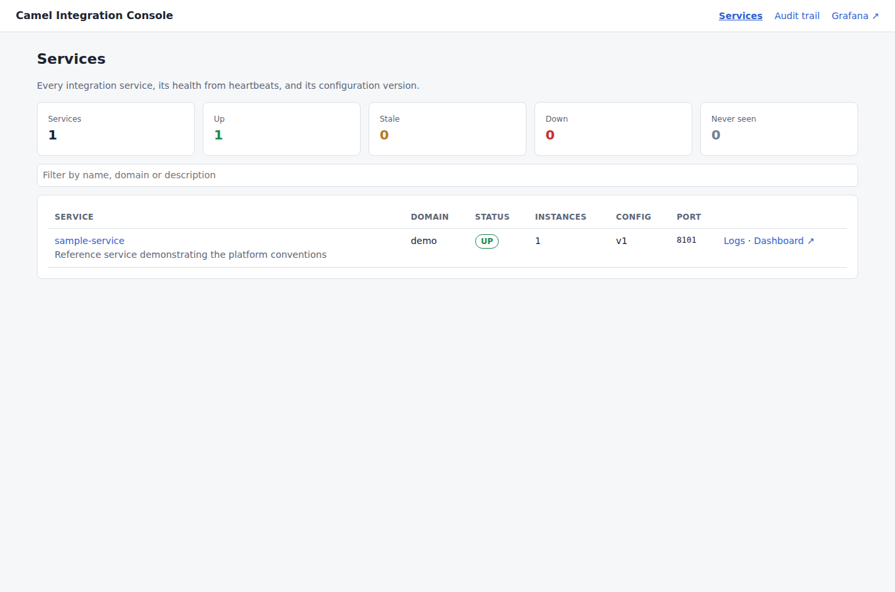
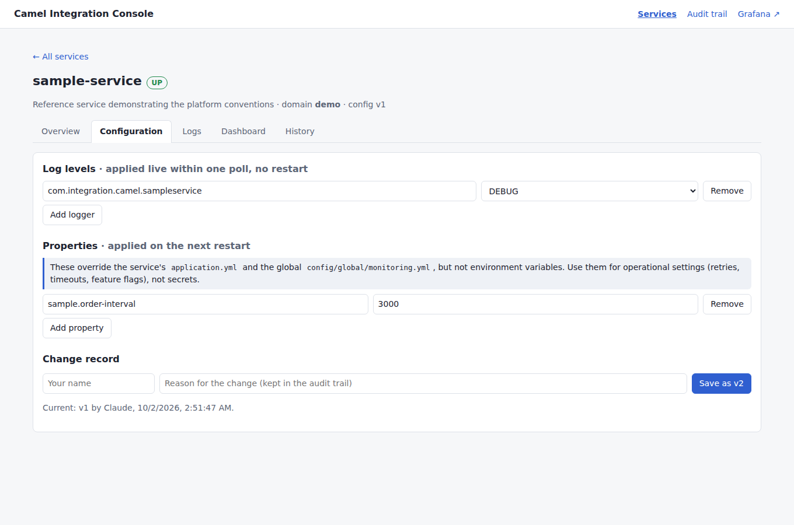
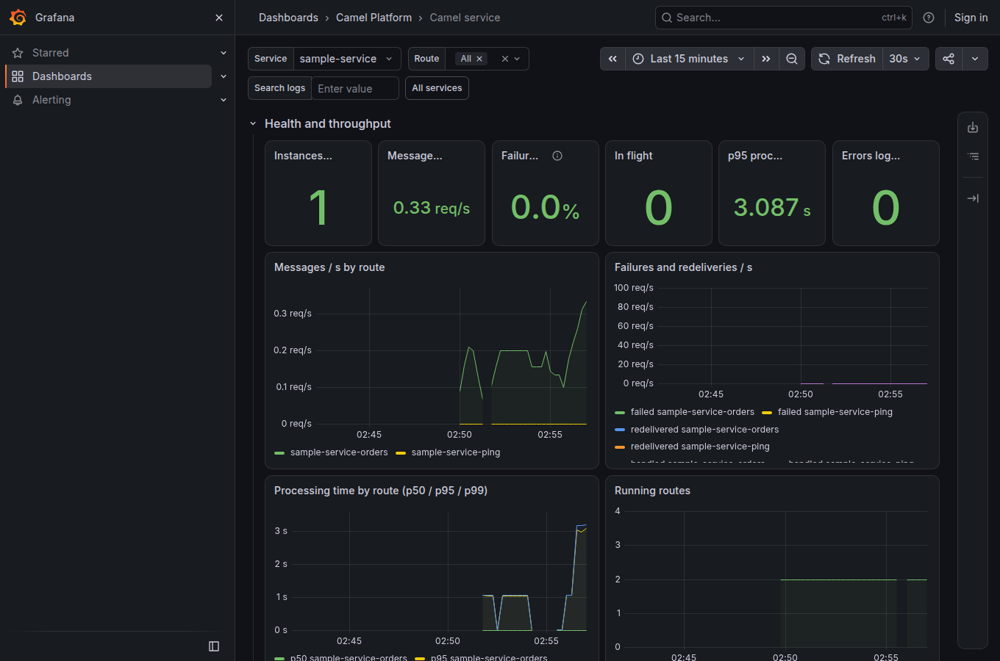

# Camel Integration Platform

One repository for the integration services migrated from IBM App Connect Enterprise to Apache Camel.
Every service lives in its own folder, reuses one shared monitoring module, ships its logs to Loki,
and is managed from one console.

```
apache-camel/
├── config/
│   ├── global/monitoring.yml        global logging, metrics, health, error-handling defaults
│   └── services.yml                 service registry (generated)
├── platform/camel-platform-starter  shared functions every service depends on
├── services/<name>/                 one folder per service (scripts/new-service.sh)
│   ├── payment-gateway/             bank-neutral payment API, one adapter per bank (BNI first)
│   └── bank-simulator/              local SNAP BI bank for tests and development only
├── console/                         management console (port 8090)
├── deploy/                          Docker Compose: PostgreSQL, Loki, Prometheus, Alloy, Grafana, console, services
├── templates/service/               template used by new-service.sh
└── scripts/                         new-service.sh, gen-compose.sh, stack.sh
```

## Quick start (local)

Requirements: Java 25 (JDK), Maven 3.9+, Docker with Compose v2.

```bash
bash scripts/stack.sh up        # builds jars and images, starts everything
```

| What | URL |
|---|---|
| Console | http://localhost:8090 |
| Grafana | http://localhost:3000 (admin / admin; anonymous viewing on) |
| Prometheus | http://localhost:9090 |
| PostgreSQL | localhost:5432, this machine only (admin user `postgres`; passwords are generated into git-ignored `deploy/.env`) |
| sample-service | http://localhost:8101/api/sample-service/ping |

`sample-service` simulates orders every few seconds and fails about one in ten attempts, so the
dashboards, redeliveries and error logs have data straight away.

## Adding a service

```bash
bash scripts/new-service.sh order-sync --domain orders --description "Syncs orders from SAP to WMS"
```

Add `--local-only` for a development or test helper such as a partner simulator: it runs in the local
stack but `scripts/deployable-services.sh` (the list any release or production manifest must use) leaves it out.
A service's own local secrets (credentials, keys) go in git-ignored `deploy/env/<service>.env`; its endpoints stay in Git.

This creates `services/order-sync/` (pom, `Application`, `OrderSyncRoutes`, test, `application.yml`),
adds the module to `services/pom.xml`, registers it with the next free port in `config/services.yml`,
and regenerates `deploy/docker-compose.services.yml`. Then implement the routes.

A service that keeps state gets its own PostgreSQL database with `--database`:

```bash
bash scripts/new-service.sh ledger-sync --domain finance --database
```

That adds JDBC, Flyway (`src/main/resources/db/migration/V1__create_schema.sql`) and a Testcontainers test,
and marks `database: true` in the registry. On the next `stack.sh up` the `db-provision` job creates the
`ledger_sync` database and role, and the service receives `SPRING_DATASOURCE_*`. Rules: CLAUDE.md rule 11.

## What every service gets from the starter

| Concern | How |
|---|---|
| Logs | JSON (Elastic Common Schema) on stdout; Grafana Alloy ships them to Loki, labelled `service`, `domain`, `level`, `environment`, `instance` |
| Correlation | `X-Correlation-Id` (or JMS correlation ID, or generated) on every log line and propagated downstream |
| Errors | Dead letter channel with exponential back-off for every route; a transacted variant for IBM MQ |
| Metrics | Camel route metrics + JVM metrics at `/actuator/prometheus`, tagged `service/domain/environment`; p50/p95/p99 histograms |
| Health | `/actuator/health/liveness` and `/readiness` for Kubernetes probes |
| Console | Pulls its settings at start-up and every 15 s, applies log levels live, sends heartbeats with route states |
| Business events | `PlatformLog.event(log, exchange, "order.received", "orderId", id)` → `event.action`, `labels.orderId` |

Configuration precedence, highest first: environment variables / `-D` → console store → service
`application.yml` → `config/global/monitoring.yml`.

## The console



- **Services**: status from heartbeats (Up, Stale, Down, Never seen), instances, config version.
- **Overview**: per instance, version, Camel version, applied config version, and every route's state.
- **Configuration**: log levels (applied live, no restart) and properties (applied on restart), each save
  versioned with name and reason.
- **Logs**: search Loki by level, text and correlation ID; click a correlation ID to follow one message;
  open the same query in Grafana Explore.
- **Dashboard**: the Grafana service dashboard embedded and filtered to the service.
- **Audit trail**: every change, who, when, why.



## Grafana

Two provisioned dashboards (Camel Platform folder): **Camel platform overview** (all services, sorted by
failures) and **Camel service** (throughput, failure ratio, in-flight, p50/p95/p99 by route, log volume
by level, error logs, all logs with search, JVM). Edit `deploy/grafana/build_dashboards.py` and re-run it.



## Production notes (not done yet, deliberately)

- **Security**: the console has only an optional shared write token (`CONSOLE_WRITE_TOKEN`). Put it behind
  SSO (OIDC) and role-based access before any shared environment; Grafana anonymous access must be turned off.
- **PostgreSQL**: the local stack runs one PostgreSQL with a shared local password. Shared environments use a
  managed PostgreSQL 18 with a separate role and secret per service, backups and point-in-time recovery.
  The console keeps settings, audit trail and heartbeats in its own database, so it can run several replicas.
- **Kubernetes**: replace Compose with Helm/Kustomize; Alloy uses `discovery.kubernetes` and pod labels
  `camel.platform/service` and `camel.platform/domain` instead of Docker labels. Drop `instance` as a Loki
  label (pod churn raises cardinality) and keep it as structured metadata.
- **Loki**: single-process filesystem mode here; production needs object storage and a scalable mode.
- **IBM MQ**: not in the local stack. Add `camel-jms-starter` + the IBM MQ client per service and use the
  transacted route configuration.
- **Tracing**: not included; add `camel-opentelemetry2` with Grafana Tempo when needed.
